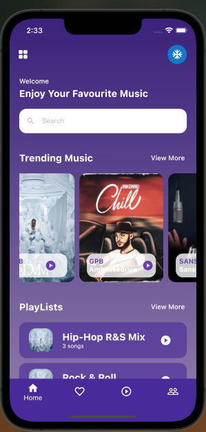
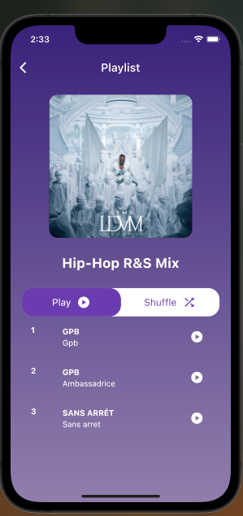
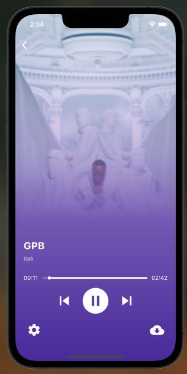

# MyMazzika Flutter Application

MyMazzika is a beautiful UI application built using Flutter, designed to provide an enjoyable music listening experience across different devices.

## Features

- Browse and view all available music.
- Search for specific songs.
- Access playlists and view their contents.
- Play music with a sleek and user-friendly UI.

## Screens

The project includes the following screens:

- **Home**: This screen showcases the home UI, where users can search for music, discover trending tracks, and access playlists.
  
  

- **Playlist**: When a playlist is selected from the home screen, this screen displays the playlist along with its associated songs.
  
  

- **Play Music**: Upon selecting a music track, this screen allows users to play the selected song while enjoying an immersive UI.
  
  

The screenshots for each screen can be found in the `screens` folder within the repository.

Feel free to explore the repository and the screenshots to get a better understanding of the application's design and functionality.

## Installation

To run the MyMazzika application on different platforms, follow these steps:

- Android: Clone the repository, open the project in Android Studio, and run it on an Android emulator or device.
- iOS: Clone the repository, open the project in Xcode, and run it on an iOS simulator or device.
- Desktop: Clone the repository, follow the Flutter desktop installation instructions for your operating system, and run the application.
- Web: Clone the repository and use the Flutter web support to run the application in a web browser.

Make sure you have the necessary dependencies and a compatible version of Flutter installed for your target platform.

## Contributing

If you'd like to contribute to this project, please follow these guidelines:

1. Fork the repository.
2. Create a new branch: `git checkout -b feature/your-feature`.
3. Make your changes and commit them: `git commit -m 'Add your feature'`.
4. Push to the branch: `git push origin feature/your-feature`.
5. Submit a pull request.

Please ensure your code follows the project's coding style and includes appropriate documentation.

## License

This project is licensed under the [MIT License](LICENSE). Feel free to use and modify the code according to your needs.

## Acknowledgements

We would like to thank the following resources for their contributions and inspiration:

- [Flutter](https://flutter.dev) - The framework used to develop the MyMazzika application.
- [Music API](https://api.example.com) - The API used to retrieve music data.
- [FontAwesome](https://fontawesome.com) - The source of icons used in the application's UI.

If you have any questions or feedback, please don't hesitate to contact us.
## Source Code

If you are interested in obtaining the source code for the MyMazzika application, please feel free to contact me. I would be happy to share the code with you and assist you further.

You can reach me at:

- Email: abdelilahfalih@gmail.com

Please provide a brief description of your intended use or any specific questions you may have about the code.

Thank you for your interest in MyMazzika!

